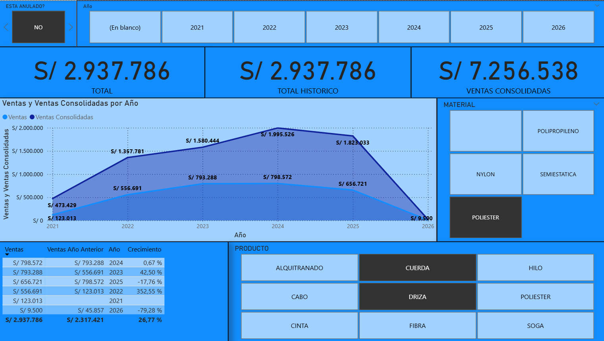
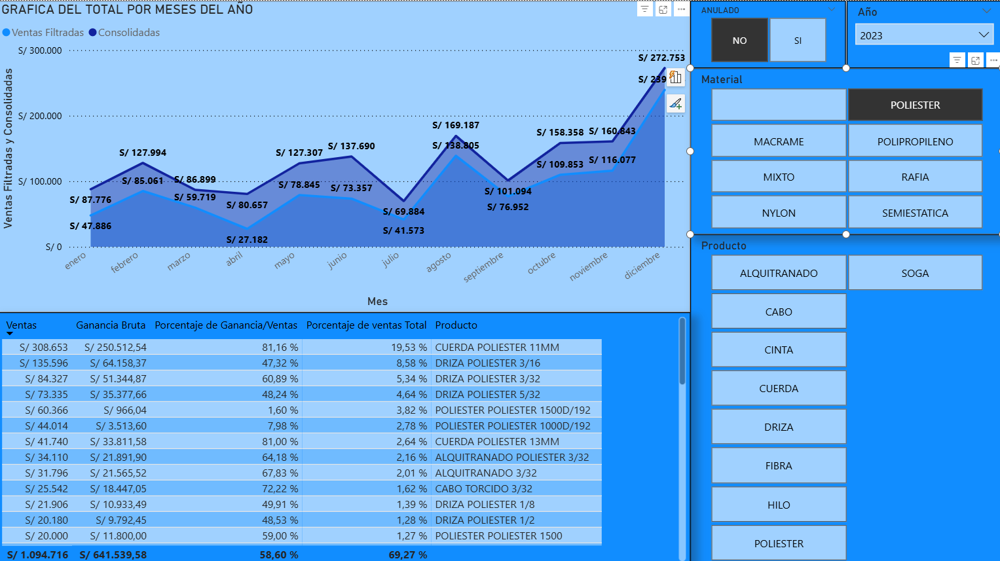
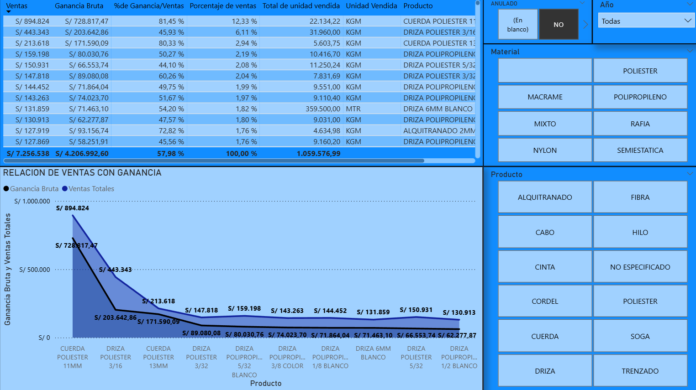
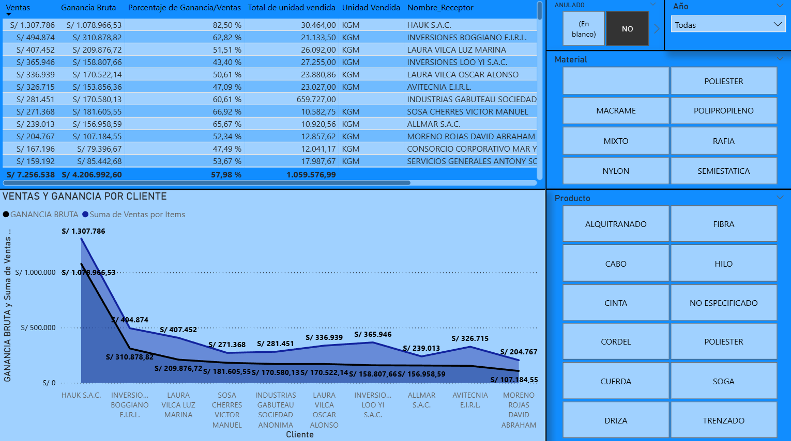
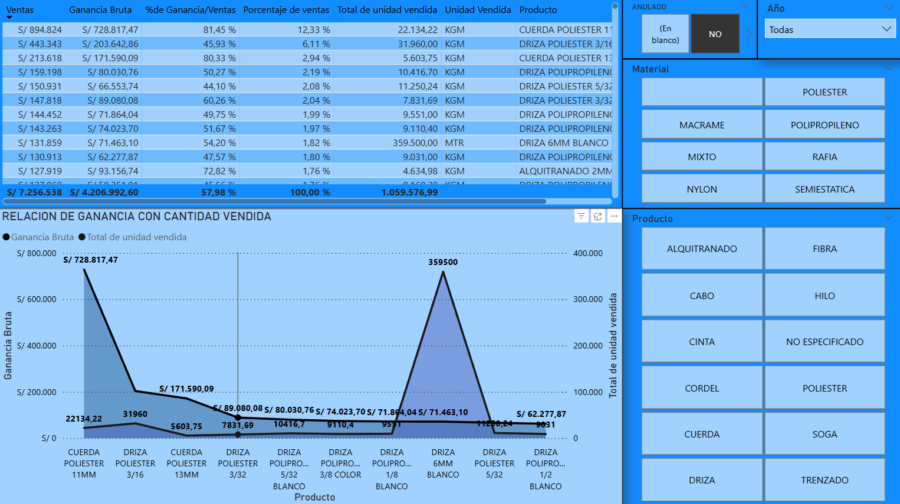

# Automatización Python – Ventas SUNAT (Facturas y Notas de Crédito) + Power BI

Este proyecto automatiza el procesamiento de comprobantes electrónicos SUNAT (UBL) a partir de archivos ZIP descargados del portal (o del sistema de la empresa). Extrae los XML, normaliza campos clave y genera archivos CSV listos para análisis y modelamiento en Power BI.

Incluye:
- Procesamiento de **Facturas (Invoice)** y extracción de **Items**.
- Detección de **Notas de Crédito (CreditNote)**, incluyendo **documento referenciado** y **motivo** (ej. anulación).
- Generación de una dimensión de productos (`dim_productos.csv`) que replica el comportamiento de `DISTINCT(Items[Descripcion])` en Power BI, y además crea atributos estandarizados (familia, material, medida, color, etc.) mediante reglas.

---

## Estructura del proyecto

```

AUTOMATIZACION PYTHON VENTAS POR SUNAT/
│
├─ VENTAS/
│   ├─ descargas_zip/              # ZIPS de FACTURAS (Invoice)
│   ├─ salida_csv/                 # Salida generada (CSV)
│   ├─ main.py                     # ETL Facturas + Items + control + anulaciones
│   └─ main_dim_productos.py       # Dimensión productos (like DISTINCT Power BI)
│
└─ NOTAS DE CREDITO/
├─ descargas_zip/              # ZIPS de NOTAS DE CRÉDITO (CreditNote)
├─ salida_csv/                 # Salida generada (CSV)
└─ main.py                     # ETL Notas de crédito + Items

````

> Importante: cada carpeta tiene su propia `descargas_zip` y genera sus propios CSV en `salida_csv`.

---

## Requisitos

- Python 3.10+ recomendado
- Librerías:
  - (VENTAS) usa librerías estándar: `os`, `re`, `zipfile`, `shutil`, `csv`, `xml.etree.ElementTree`
  - (DIM PRODUCTOS) usa: `pandas`, `unicodedata`, `re`

Instalación (para la dimensión de productos):
```bash
pip install pandas
````

---

## Cómo usar (flujo recomendado)

### 1) Descargar ZIPs SUNAT

Descarga los ZIPs desde SUNAT o desde el repositorio/documentos internos de la empresa.

### 2) Facturas (VENTAS)

1. Copia los ZIP de facturas en:
   `VENTAS/descargas_zip/`

2. Ejecuta el script principal:

```bash
cd "VENTAS"
python main.py
```

Esto generará (en `VENTAS/salida_csv/`):

* `facturas.csv` (documentos: Invoice y CreditNote si aparecen dentro de los ZIP)
* `items.csv` (líneas de factura: InvoiceLine)
* `anulaciones.csv` (notas de crédito con motivo 01 detectadas)
* `errores.csv` (XML/ZIP que fallaron)
* Archivos de control: `resumen_control.csv`, `faltantes.csv`, `duplicados.csv`

3. Ejecuta la dimensión de productos:

```bash
python main_dim_productos.py
```

Esto genera:

* `dim_productos.csv` con:

  * `Producto_PBI` (DISTINCT “crudo” como Power BI)
  * `ProductoStd` (normalizado/estandarizado)
  * `FamiliaProducto`, `Caracteristica`, `ProcesoExtra`, `Material`, `MedidaStd`, `ColorStd`

Relación sugerida en Power BI:

* `Dim_Productos[Producto_PBI]` → `Items[Descripcion]` (1 a 1)

---

### 3) Notas de Crédito (NOTAS DE CREDITO)

1. Copia los ZIP de notas de crédito en:
   `NOTAS DE CREDITO/descargas_zip/`

2. Ejecuta el script:

```bash
cd "../NOTAS DE CREDITO"
python main.py
```

Esto genera (en `NOTAS DE CREDITO/salida_csv/`):

* `notas_credito.csv`
* `notas_credito_items.csv`
* `errores.csv`

---

## Importación a Power BI y modelamiento recomendado

1. Importa los CSV:

* `VENTAS/salida_csv/facturas.csv`
* `VENTAS/salida_csv/items.csv`
* `VENTAS/salida_csv/dim_productos.csv`
* (Opcional) `VENTAS/salida_csv/anulaciones.csv`
* (Opcional) `NOTAS DE CREDITO/salida_csv/notas_credito.csv`
* (Opcional) `NOTAS DE CREDITO/salida_csv/notas_credito_items.csv`

2. Relaciones típicas:

* `Facturas[DocumentoKey]` 1 — * `Items[DocumentoKey]`
* `Dim_Productos[Producto_PBI]` 1 — * `Items[Descripcion]`

3. Anulaciones:

* En `VENTAS/main.py` se marca `EsAnulado = SI` si una NCE (motivo 01) referencia ese documento.
* En Power BI puedes filtrar ventas válidas con `EsAnulado = NO`.

---

## Nota importante sobre personalización (reglas por empresa)

El script `main_dim_productos.py` (dimensión de productos) fue construido a partir de un análisis específico del catálogo de una empresa industrial de sogas (materiales, medidas, procesos y variaciones de nombres).

Si deseas reutilizar este proyecto en otra empresa, normalmente solo tendrás que modificar:

* Las reglas de normalización (`normalize_text`)
* Listas de palabras clave / jerarquías:

  * `pick_family`
  * `pick_caracteristica`
  * `pick_material`
  * `pick_medida`
  * `COLOR_LIST`

Los scripts de extracción de XML (facturas/notas) suelen funcionar sin cambios, siempre que el formato siga el estándar UBL/SUNAT.

---

## Resultados del análisis (caso real)

En el caso analizado:

* Se procesaron **más de 1000 facturas**.
* Existían **más de 1000 “productos distintos”** debido a pequeñas variaciones en la descripción (errores ortográficos, espacios, símbolos, formatos de medida).
* Con la estandarización y reglas de clasificación:

  * Se redujo el catálogo a **~200 productos estandarizados**.
  * Se consolidaron **7 materiales principales**.
  * Se definieron **12 familias de productos** para análisis (por ejemplo: DRIZA, CABO, CORDEL, CUERDA, HILO, CINTA, ALQUITRANADO, etc.).
* Se habilitó un dashboard en Power BI para:

  * Ventas consolidadas / históricas
  * Ventas por cliente
  * Ventas por producto y familias
  * Tendencia mensual
  * Filtros por anulación, material y familia

### Capturas (Power BI)


## Resultados generales

### Ventas Totales y Crecimiento
- 

### Ventas Mensuales y Ganancia
- 

## Dimensiones clave

### Ganancia Bruta por Producto
- 

### Ganancia Bruta y Ventas por Cliente
- 

## Indicadores complementarios

### Ganancia en función de la Cantidad Vendida
- 
---

## Troubleshooting (común)

* **“No encontré columna Descripcion”**: revisa que `items.csv` tenga exactamente la columna `Descripcion`.
* **Diferencias de DISTINCT entre Python y Power BI**:

  * Este proyecto usa `Producto_PBI` como texto crudo (sin limpiar) para que coincida con Power BI y permita relación 1 a 1.
* **Encoding raro (DIÁMETRO)**:

  * Puede ser problema de encoding del origen. Si aparece, ajusta la lectura en pandas (`encoding=`) o normaliza caracteres en `normalize_text`.

---

## Licencia / Uso

Proyecto académico/práctico. Puedes reutilizarlo adaptando las reglas de producto según tu negocio.

````


